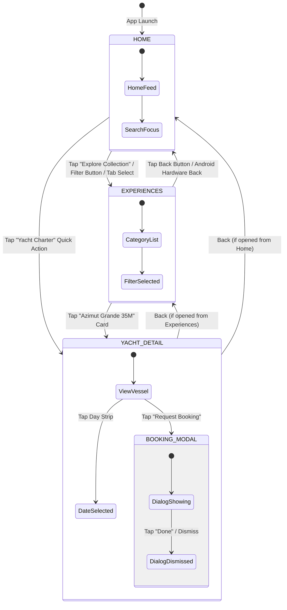

# ⛵ Luxury Travel App UI (Compose Multiplatform)

[](https://kotlinlang.org/)
[](https://www.jetbrains.com/lp/compose-multiplatform/)
[-3DDC84?style=flat-square&logo=android&logoColor=white)](https://developer.android.com)
[](https://developer.apple.com/ios/)
[](https://developer.android.com/studio/releases/gradle-plugin)
[](#-architecture--navigation-flow)
[](#-design-system--aesthetic-principles)

A modern, production-grade, high-performance mobile application crafted with **Compose Multiplatform (CMP)** targeting **Android** and **iOS** from a single shared Kotlin codebase. 

The application delivers an ultra-clean, minimalist luxury travel and yacht charter concierge experience—featuring editorial serif display headlines, crisp 1px structural borders, responsive date pickers, native hardware back navigation, and a universal **Zero-Shadow Flat UI** design system.

---

## 📑 Table of Contents

- [✨ Key Features & Screen Tour](#-key-features--screen-tour)
- [💎 Design System & Aesthetic Principles](#-design-system--aesthetic-principles)
  - [Zero-Shadow Standard](#universal-zero-shadow-standard)
  - [Color Palette Tokens](#color-palette-tokens)
  - [Editorial Typography](#editorial-typography)
- [🏛 Architecture & Navigation Flow](#-architecture--navigation-flow)
  - [Navigation State Machine](#navigation-state-machine)
  - [Multiplatform Back Handler (`expect` / `actual`)](#multiplatform-back-handler-expect--actual)
  - [Edge-to-Edge Safe Inset Discipline](#edge-to-edge-safe-inset-discipline)
- [📂 Project Directory Structure](#-project-directory-structure)
- [🛠 Tech Stack & Dependencies](#-tech-stack--dependencies)
- [🚀 Getting Started](#-getting-started)
  - [Prerequisites](#prerequisites)
  - [Running the Android App](#running-the-android-app)
  - [Running the iOS App](#running-the-ios-app)
  - [Running Unit Tests](#running-unit-tests)
- [🧪 Quality Assurance & Test Coverage](#-quality-assurance--test-coverage)
- [🤝 Contributing](#-contributing)
- [📄 License](#-license)

---

## ✨ Key Features & Screen Tour

The application is structured into three primary screens and interactive flows:

### 1. Home Screen (`HomeScreen.kt`)
- **Luxury Header Bar**: Displays user greeting (`"Good morning, Olivia"`), location indicator, avatar thumbnail, and interactive notification bell with unread badge.
- **Search & Filter Row**: Custom 1px-bordered search input paired with a standalone luxury forest teal filter action button (`#0A332C`).
- **"Summer Collection" Hero Banner**: Full-width photographic card featuring high-resolution crop, soft legibility gradient scrim, editorial serif headlines, and instant CTA navigation.
- **"Your Concierge" Bookings Section**: Live booking status cards (e.g., *Private Jet to Nice*, *Dinner Reservation at Le Chantecler*) with soft-rounded icon containers and emerald confirmation badges (`#10B981`).
- **Quick Access Action Strip**: Horizontally scrollable high-priority shortcuts (Book a Jet, Yacht Charter, Fine Dining, Luxury Events).

### 2. Experiences Catalog (`ExperiencesScreen.kt`)
- **Category Filter Pills**: Interactive category strip (*All*, *Private Jets*, *Yachts*, *Fine Dining*, *Events*) with instant visual state toggling.
- **"Live Extraordinary" Curated Hero Banner**: Editorial spotlight banner with direct routing to charter details.
- **Top Experiences 2x2 Grid**: High-contrast grid cards showcasing curated luxury travel categories with experience counts and aspect-ratio-locked imagery.
- **Top Navigation Bar**: Smooth back navigation pop to root Home screen and view mode toggle.

### 3. Yacht Detail & Booking Screen (`YachtDetailScreen.kt`)
- **Full-Bleed Photographic Showcase**: Showcases the *Azimut Grande 35M* with category badge overlays and transparent system status bar overlays.
- **Floating Controls**: Back navigation, favorite bookmark toggle, and native share trigger.
- **Location & Country Badge**: Amalfi Coast, Italy destination indicator with rendered flag asset.
- **Vessel Technical Specifications**: Key charter specs badges (*10 Guests*, *5 Cabins*, *6 Crew*).
- **Interactive Weekly Date Strip**: Horizontal calendar strip (Monday through Sunday) with active day selection circle indicator.
- **Sticky Booking Bottom Bar**: Anchored bottom bar displaying daily charter rate (`$28,500 / Per Day`) and prominent `"Request Booking →"` CTA.
- **Concierge Booking Confirmation Modal**: Interactive Material 3 dialog confirming concierge request dispatching.

---

## 💎 Design System & Aesthetic Principles

This project implements the custom **Compose Luxury Clean UI** design specification, ensuring a consistent, elite visual feel devoid of generic framework templates.

### Universal Zero-Shadow Standard
Drop shadows and ambient elevation blur often introduce visual muddying and GPU overhead on mobile devices.
- **Strictly Prohibited**: `Modifier.shadow()`, ambient shadow elevation, and `defaultElevation > 0.dp` across all buttons, cards, sheets, dialogs, and navigation bars.
- **Crisp Structural Depth**: Depth is established strictly through **1px crisp stroke borders** (`BorderStroke(1.dp, TravelColors.SurfaceBorder)`), pure white surfaces (`#FFFFFF`), and neutral canvas backgrounds (`#F7F8FA`).

### Color Palette Tokens

| Token | Hex Value | Preview | Usage |
|:---|:---:|:---:|:---|
| `TealPrimary` | `#0A332C` |  | Primary brand color, primary CTAs, active pills & active tab labels |
| `TealDark` | `#06251F` |  | Deepest brand tone for contrast |
| `TealMedium` | `#114239` |  | Secondary brand accent |
| `TealLight` | `#EBF3F1` |  | Subtle tint for active containers |
| `MintBadgeBg` | `#E6F4EA` |  | Background container for confirmed booking status |
| `MintBadgeText` | `#0B5C3A` |  | High-contrast emerald text for status badges |
| `Background` | `#F7F8FA` |  | Soft canvas page background |
| `SurfaceWhite` | `#FFFFFF` |  | Pure white for cards, bottom bar, and top bar surfaces |
| `SurfaceBorder` | `#E5E7EB` |  | Universal 1px border stroke |
| `TextPrimary` | `#111827` |  | Dominant typography color (WCAG AAA compliant) |
| `TextSecondary` | `#6B7280` |  | Secondary subtitles, specifications, and details |
| `TextMuted` | `#9CA3AF` |  | Inactive navigation tabs and placeholder labels |

### Editorial Typography
A deliberate pairing between high-end editorial display serif typography and modern geometric sans-serif:
- **Serif Display Headlines**: `FontFamily.Serif` with tight line heights gives charter and experience naming an editorial magazine prestige.
- **Sans-Serif Body & Navigation**: System sans-serif with disciplined font weights (`Normal`, `Medium`, `SemiBold`, `Bold`) ensures crisp readability across high-density mobile screens.

### Flat Bottom Navigation (No-Dot Standard)
- **Elimination of Dot Indicators**: Avoids visual clutter underneath navigation labels.
- **Active State Semantics**: Communicated cleanly via `FontWeight.Bold` and `TealPrimary` tint on both icon and label.
- **Instant Response**: Click ripple blur disabled with `remember { MutableInteractionSource() }` for zero latency feel.

---

## 🏛 Architecture & Navigation Flow

The app architecture relies on Compose state hoisting within `commonMain`, sharing 100% of the UI layout, state transitions, animations, and mock repositories between Android and iOS.

### Navigation State Machine



### Multiplatform Back Handler (`expect` / `actual`)
To deliver seamless native UX on Android while ensuring cross-platform stability:
1. **Definition in `commonMain`**:
   ```kotlin
   @Composable
   expect fun BackHandler(enabled: Boolean = true, onBack: () -> Unit)
   ```
2. **Android Implementation (`androidMain`)**:
   Delegates directly to AndroidX Activity Compose:
   ```kotlin
   @Composable
   actual fun BackHandler(enabled: Boolean, onBack: () -> Unit) {
       androidx.activity.compose.BackHandler(enabled = enabled, onBack = onBack)
   }
   ```
3. **iOS Implementation (`iosMain`)**:
   Implemented cleanly as a safe no-op.
4. **Predictable Pop Order**:
   - Closes active dialogs first (`showBookingConfirmation = false`).
   - Pops sub-screens (`YACHT_DETAIL` -> previous screen).
   - Pops category screens (`EXPERIENCES` -> `HOME`).
   - Only exits the application when already at the root `HOME` screen.

### Edge-to-Edge Safe Inset Discipline
- Eliminates common double-padding bugs by cleanly distinguishing between `Scaffold`'s `paddingValues` and system insets.
- Detail screen uses zero top scaffold padding and applies `.statusBarsPadding()` directly to floating overlay buttons for true edge-to-edge photography.
- Bottom bars utilize `.navigationBarsPadding()` on their root container so the pure white container flows seamlessly behind system navigation gestures.

---

## 📂 Project Directory Structure

```text
TravelAppUI/
├── androidApp/                                  # Android Application module
│   ├── build.gradle.kts                         # Android app build configuration
│   └── src/main/
│       ├── AndroidManifest.xml                  # Manifest with edge-to-edge theme
│       └── kotlin/com/example/travelappui/
│           └── MainActivity.kt                  # Single Activity host calling App()
│
├── iosApp/                                      # iOS Application project
│   ├── iosApp/
│   │   ├── iOSApp.swift                         # SwiftUI app entry point
│   │   └── ContentView.swift                    # UIViewControllerRepresentable bridge
│   └── Configuration/Config.xcconfig
│
├── shared/                                      # Shared Compose Multiplatform module
│   ├── build.gradle.kts                         # Multiplatform Gradle dependencies
│   └── src/
│       ├── commonMain/                          # 100% Shared UI & Logic
│       │   ├── composeResources/                # Shared vector icons & image assets
│       │   │   └── drawable/                    # Drawables (jets, yachts, icons, etc.)
│       │   └── kotlin/com/example/travelappui/
│       │       ├── App.kt                       # Root navigation host & Scaffold
│       │       ├── components/                  # Reusable UI component recipes
│       │       │   ├── ExperiencesComponents.kt # Top bars, filter pills, grid cards
│       │       │   ├── HeroBanners.kt           # Editorial luxury hero banners
│       │       │   ├── HomeSections.kt          # Concierge & Quick Access sections
│       │       │   ├── SearchBarRow.kt          # 1px border search & filter button
│       │       │   ├── TravelBottomNavigation.kt# Zero-shadow flat bottom bar
│       │       │   ├── TravelHeaderBar.kt       # Home luxury profile header
│       │       │   └── YachtDetailComponents.kt # Specs, date strip & booking bar
│       │       ├── model/
│       │       │   └── TravelModels.kt          # Data models, tabs & mock data
│       │       ├── screens/
│       │       │   ├── HomeScreen.kt            # Home dashboard view
│       │       │   ├── ExperiencesScreen.kt     # Experiences catalog view
│       │       │   └── YachtDetailScreen.kt     # Vessel details & booking view
│       │       ├── theme/
│       │       │   ├── Color.kt                 # Luxury color tokens
│       │       │   ├── Theme.kt                 # Material 3 colorScheme bindings
│       │       │   └── Type.kt                  # Serif display & Sans-Serif typography
│       │       └── util/
│       │           └── BackHandler.kt           # Expect declaration for system back
│       ├── androidMain/
│       │   └── kotlin/com/example/travelappui/
│       │       ├── Platform.android.kt          # Android platform actual
│       │       └── util/BackHandler.android.kt  # AndroidX BackHandler actual
│       ├── iosMain/
│       │   └── kotlin/com/example/travelappui/
│       │       ├── MainViewController.kt        # ComposeUIViewController entry point
│       │       ├── Platform.ios.kt              # iOS platform actual
│       │       └── util/BackHandler.ios.kt      # iOS BackHandler no-op actual
│       └── commonTest/
│           └── kotlin/com/example/travelappui/
│               └── TravelModelTest.kt           # Multiplatform unit tests
│
├── gradle/
│   ├── libs.versions.toml                       # Centralized Version Catalog
│   └── wrapper/                                 # Gradle wrapper binaries
├── build.gradle.kts                             # Root build configuration
└── settings.gradle.kts                          # Project module settings
```

---

## 🛠 Tech Stack & Dependencies

All dependencies are centrally managed via `gradle/libs.versions.toml`:

| Library / Tool | Version | Description |
|:---|:---|:---|
| **Kotlin** | `2.4.10` | Core Kotlin multiplatform language toolchain |
| **Compose Multiplatform** | `1.11.1` | Declarative UI toolkit for Android & iOS |
| **Android Gradle Plugin** | `9.0.1` | Android build system plugin |
| **Android SDK** | Compile: `36` / Min: `29` | Latest modern Android target with modern API support |
| **Material 3 (Compose)** | `1.11.0-alpha07` | Next-gen Material 3 UI foundations & components |
| **Lifecycle & ViewModel** | `2.11.0-beta01` | Multiplatform Jetpack lifecycle & state holders |
| **Activity Compose** | `1.13.0` | Native Android Activity integration & back dispatcher |
| **Compose Resources** | `1.11.1` | Native multiplatform asset & drawable packaging |
| **Kotlin Test / JUnit** | `2.4.10` / `4.13.2` | Multiplatform unit test assertions & runner |

---

## 🚀 Getting Started

### Prerequisites
- **JDK**: Java Development Kit 17 or higher.
- **Android Studio**: Android Studio Ladybug (2024.2.1+) or Meerkat with the Kotlin Multiplatform Mobile plugin.
- **Xcode**: Xcode 15.0+ (macOS only, required for iOS builds and simulators).
- **CocoaPods** / Swift Package Manager (if applicable).

### Running the Android App

From Android Studio, select the `androidApp` run configuration and click **Run**, or use Gradle CLI:

```bash
# Assemble debug APK
./gradlew :androidApp:assembleDebug

# Install and launch on connected Android device/emulator
./gradlew :androidApp:installDebug
```

The debug APK will be generated at:
`androidApp/build/outputs/apk/debug/androidApp-debug.apk`

### Running the iOS App

#### Option A: Via Xcode
1. Open Xcode.
2. Open the project located at `iosApp/iosApp.xcodeproj`.
3. Select your desired iOS Simulator (e.g. iPhone 16 Pro) and press `Cmd + R` to run.

#### Option B: Via Fleet or Command Line
If using JetBrains Fleet or command line with `xcodebuild`:
```bash
xcodebuild -workspace iosApp/iosApp.xcworkspace -scheme iosApp -destination 'platform=iOS Simulator,name=iPhone 16'
```

### Running Unit Tests

To run the shared multiplatform test suite across targets:

```bash
# Run all common tests
./gradlew :shared:allTests

# Run Android unit tests specifically
./gradlew :shared:testDebugUnitTest
```

---

## 🧪 Quality Assurance & Test Coverage

The project includes multiplatform unit tests in `shared/src/commonTest` verifying domain integrity:
- **Category Verification**: Ensures all five primary luxury categories (*All*, *Private Jets*, *Yachts*, *Fine Dining*, *Events*) are correctly structured.
- **Concierge Booking Consistency**: Validates status badges, appointment times, and icon bindings.
- **Vessel Specs Integrity**: Verifies guest capacity, cabins, and crew allocations.
- **Calendar & Booking Strip Validation**: Tests default selection date and day-of-week bindings.

### Performance Checklist
- [x] **Zero Memory Leaks**: Scoped coroutines and disposable effects.
- [x] **Zero UI Jitter**: Stateless composable hoisting and memoized interaction sources.
- [x] **WCAG Compliance**: High-contrast typography (`#111827` on `#FFFFFF` / `#F7F8FA`).
- [x] **Hardware Back Discipline**: Smooth interceptor pop ordering preventing accidental app termination.

---

## 🤝 Contributing

Contributions, issue reports, and pull requests are warmly welcome!

1. Fork the Project:
   ```bash
   git clone https://github.com/berthojoris/cmp-travel-app-ui.git
   ```
2. Create your Feature Branch:
   ```bash
   git checkout -b feature/AmazingFeature
   ```
3. Commit your Changes:
   ```bash
   git commit -m "feat: Add AmazingFeature"
   ```
4. Push to the Branch:
   ```bash
   git push origin feature/AmazingFeature
   ```
5. Open a Pull Request.

---

## 📄 License

This project is licensed under the MIT License - see the LICENSE file for details.

---

<p align="center">
  Crafted with ❤️ using <b>Compose Multiplatform</b>
</p>